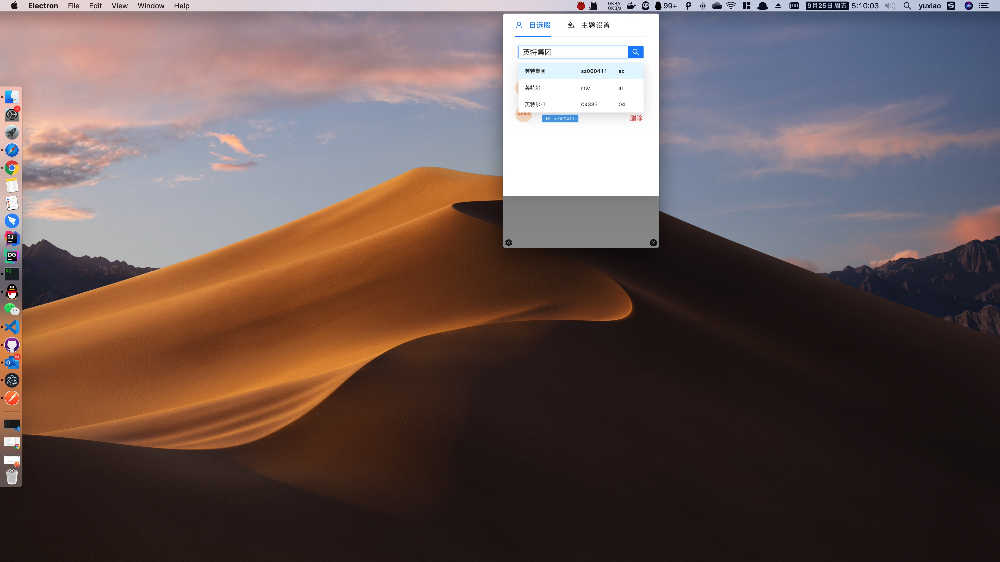
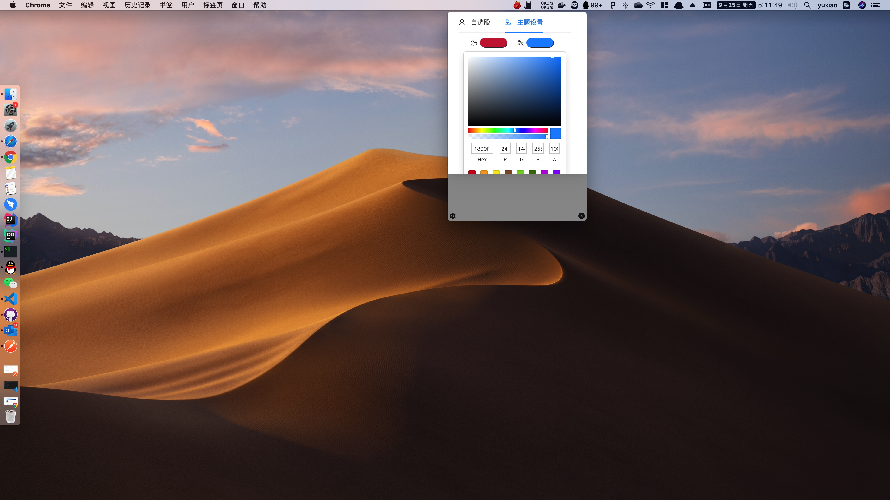
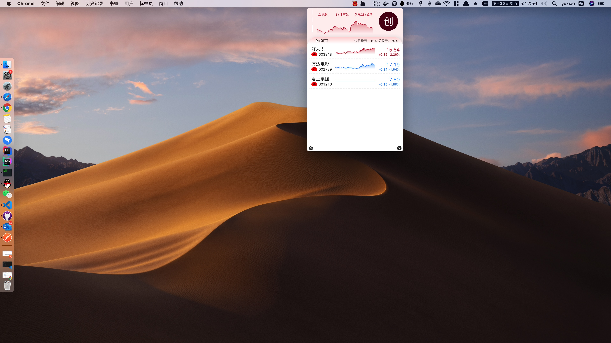

```text
_____________                           ______
__  ___/__  /_______ ______________________  /_______ ________
_____ \__  __ \  __ `/_  ___/  _ \_  ___/_  __ \  __ `/_  ___/
____/ /_  / / / /_/ /_  /   /  __/(__  )_  /_/ / /_/ /_  /
/____/ /_/ /_/\__,_/ /_/    \___//____/ /_.___/\__,_/ /_/
```

# MAC端看盘工具，股票盯盘软件
#### 1. 查看股票三指实时数据
#### 2. 搜索添加删除自选股
#### 3. 更改涨跌主题

## 安装
> 按住⌘键，然后点击sharesbar图标
## 截图





## 开发
1. 下载代码.
```
git clone https://github.com/willjw3/react-electron.git <your-project-name>
```
2. 安装yarn.
```
npm install -g yarn
```
3. 下载依赖.
```
cd <your-project-name> && npm install
```

4. 运行
```
npm run start
```
## 编译
1. 源码编译，编译缺啥装啥就行
```
npm run build
```
> 注意：
> 下载最新版electron(设置代理)

```
npx cross-env ELECTRON_GET_USE_PROXY=true GLOBAL_AGENT_HTTPS_PROXY=http://127.0.0.1:7890 npm install electron
```
